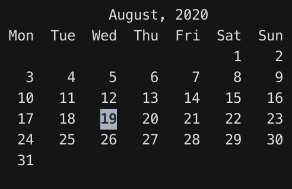

# Rust Calendar

A terminal calendar writen in Rust.

### Introduction 

A pet project to learn how to write CLI app in rust. Clone from `cal`.

### Usage

- Using left/right arrow key to go to prev/next month
- Press "q" to quit

### Track logs

I will try to keep it simple and incremental.

- [x] Create a simple cli to show current date
- [x] Render simple calendar
- [x] Support using arrow key to go to next/prev month
